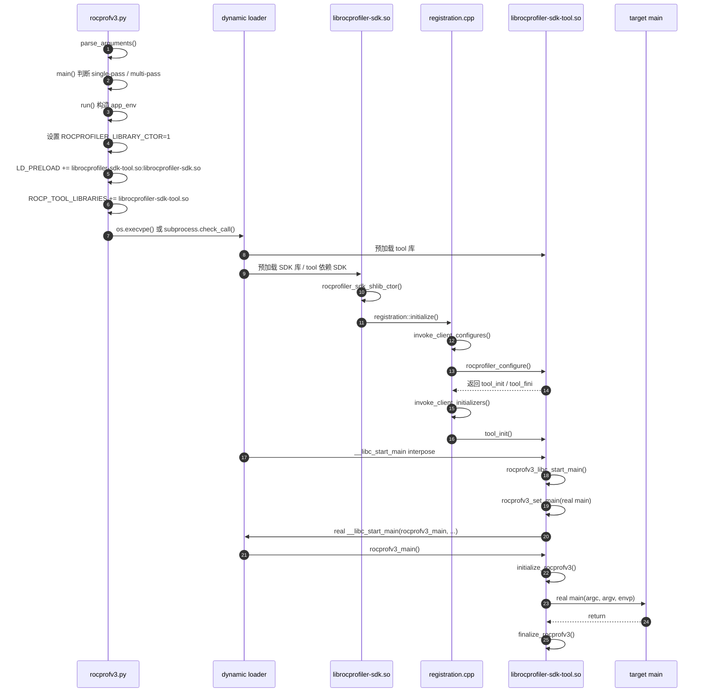
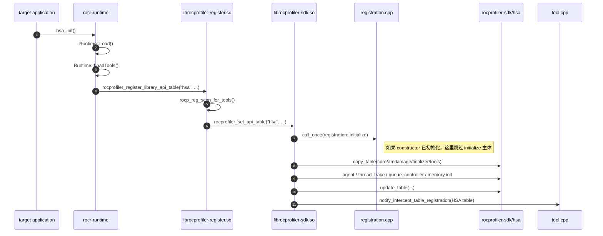
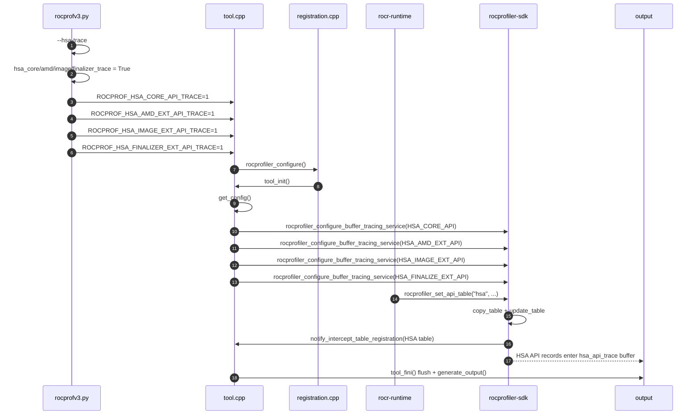
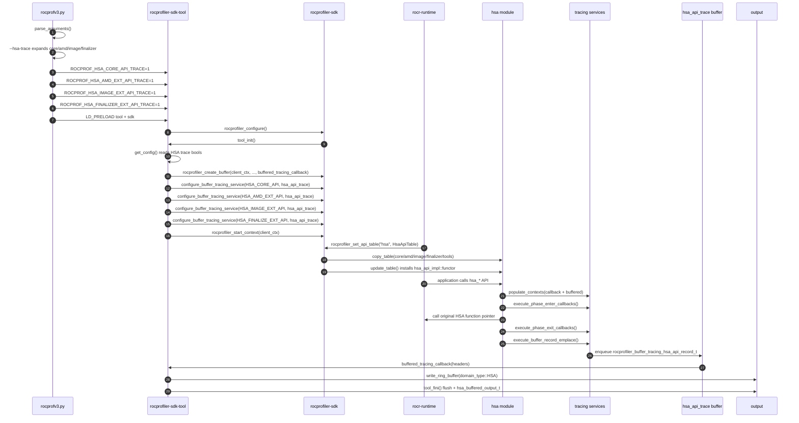
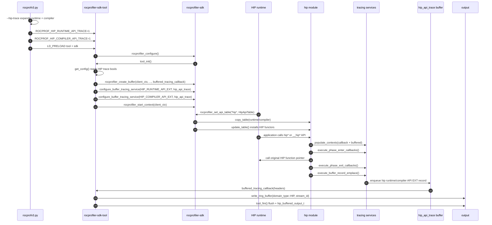
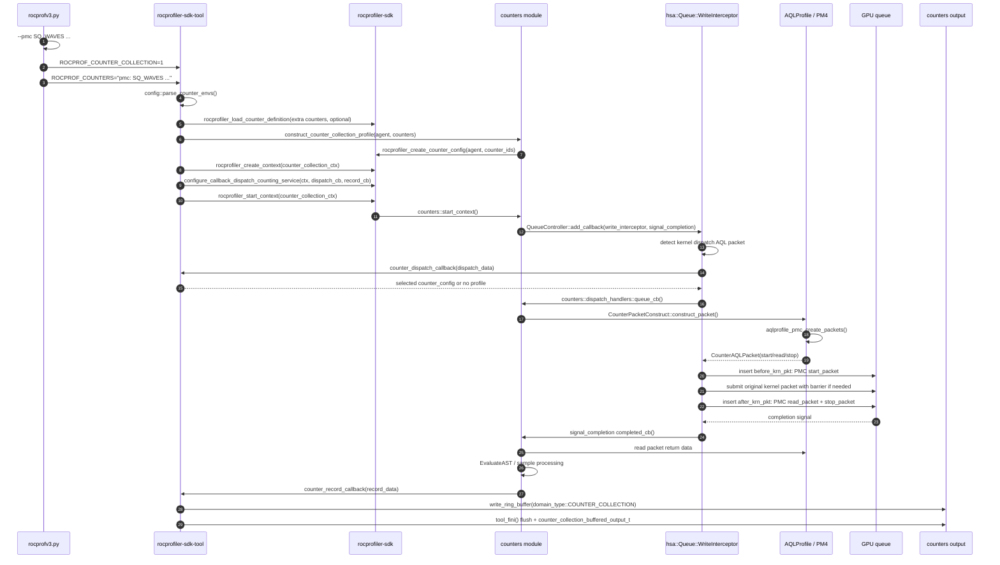
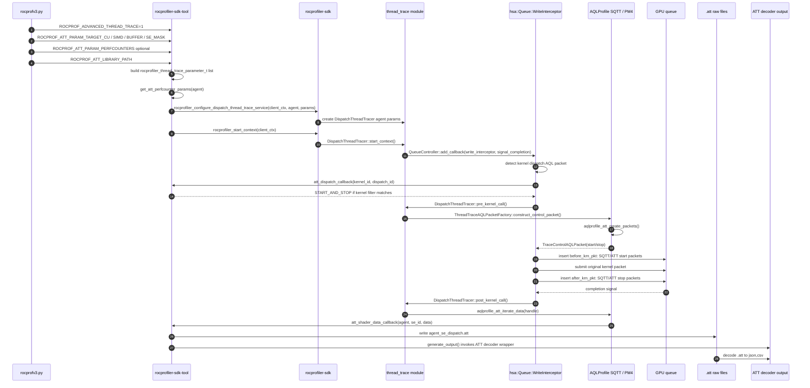
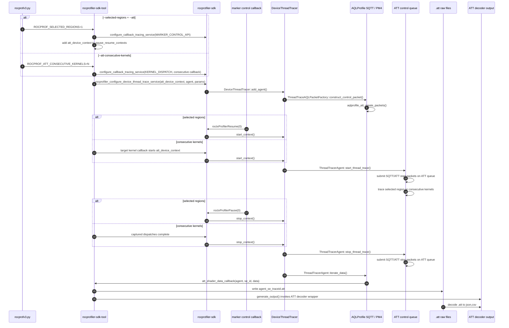

# rocprofv3 指令触发流程

## 放置位置

本页放在 `wiki/rocprofiler-sdk/modules/tools/` 下，作为 [rocprofv3](rocprofv3.md) 的流程细化页。`rocprofv3.md` 保留 CLI 总览、关键函数和公共数据流，本页专门记录各类 `rocprofv3.py` 选项如何落到环境变量、C++ 配置字段以及 SDK 服务配置，避免总览页膨胀成源码索引。

<!-- verified: 2026-06-03 -->

## 按问题查入口

| 想回答的问题 | 先看 |
|---|---|
| Python launcher 如何把 profiling tool 注入目标进程？ | [总体启动链路](#总体启动链路) |
| SDK 什么时候拿到 HSA API 表并替换函数指针？ | [HSA 运行时 API 表注册链路](#hsa-运行时-api-表注册链路) |
| 某个 CLI 选项会设置哪些环境变量和 C++ 配置字段？ | [Python 选项展开](#python-选项展开) |
| `--hsa-trace` / `--hip-trace` 这类 API trace 如何进入 buffer tracing？ | [Tracing 选项](#tracing-选项)、[`--hsa-trace` 流程](#--hsa-trace-流程)、[详细流程图](#详细流程图) |
| `--pmc` 的 counter profile、PM4 包和 dispatch 回调在哪里发生？ | [Counter collection 指令](#counter-collection-指令) |
| PC sampling 如何从 CLI 配置到采样服务，并和 kernel dispatch 关联？ | [PC Sampling 指令](#pc-sampling-指令) |
| ATT/SQTT 的 dispatch mode 和 device mode 有什么区别？ | [Advanced Thread Trace 指令](#advanced-thread-trace-指令) |
| 过滤、kernel 命名、输出格式和 stats 如何影响已有 service？ | [Filtering、命名和输出指令](#filtering命名和输出指令) |
| `--list-avail`、`--pid` / `--attach` 为什么不走普通 launch 路径？ | [Display 和 attach 指令](#display-和-attach-指令) |

## 本页边界

本页回答“用户可见的 `rocprofv3` 选项如何落到 launcher 环境变量、tool 配置、SDK service 和关键拦截点”。如果需要继续看底层模块内部实现，按下面的归属跳转：

- HSA API 表复制、functor 包装、queue controller 和 scratch memory 细节，见 [HSA 运行时拦截器](../interceptors/hsa.md)。
- counter 配置、dispatch counting API、AST 指标求值和设备级计数器，见 [硬件计数器收集模块](../core/counters.md)。
- PMC / SQTT / ATT 使用的 AQLProfile PM4 包生成，见 [AQL/PM4 Profiling 包生成](../companion/aqlprofile.md)。
- PC sampling 会话、parser、CID 管理和 HSA/KFD 后端，见 [PC 采样模块](../core/pc-sampling.md)。
- CSV/JSON/PFTrace/OTF2/ROCPD 输出格式化和统计聚合，见 [输出格式化器](../companion/output.md) 和 [ROCPD 输出格式](../companion/rocpd.md)。

## 总体启动链路

普通 launch 模式下，`rocprofv3` 的 Python 脚本不直接调用 C++ 的 `rocprofv3_main()`。它的职责是解析命令、准备环境变量，然后用这些环境变量启动目标应用。



关键点：

- `rocprofv3.py::run()` 设置 `ROCPROFILER_LIBRARY_CTOR=1`、`LD_PRELOAD`、`ROCP_TOOL_LIBRARIES`、输出配置和各类 `ROCPROF_*` 选项。
- `librocprofiler-sdk.so` 的 `rocprofiler_sdk_shlib_ctor()` 在 `ROCPROFILER_LIBRARY_CTOR=1` 时调用 `registration::initialize()`。
- `registration::initialize()` 通过 `ROCP_TOOL_LIBRARIES` 查找 `librocprofiler-sdk-tool.so` 里的 `rocprofiler_configure()`，调用后获得 `tool_init()` 和 `tool_fini()`。
- `librocprofiler-sdk-tool.so` 导出 `__libc_start_main()`，进入 `rocprofv3_libc_start_main()` 后保存真实应用 `main`，再把 glibc 启动入口替换为 `rocprofv3_main()`。
- `rocprofv3_main()` 会调用 `initialize_rocprofv3()`。如果 SDK 尚未初始化，它会用 `rocprofiler_force_configure(&rocprofiler_configure)` 强制配置；正常 launch 路径通常已由 SDK constructor 完成初始化。
- 应用 `main` 返回后，`rocprofv3_main()` 调用 `finalize_rocprofv3()`。当前代码里它调用 `tool_init()` 保存下来的 `client_finalizer`，不是再次调用 `invoke_client_initializers()`。单客户端场景下该 finalizer 会进入 `registration::finalize()`，再进入 `invoke_client_finalizers()` 和 `tool_fini()`。

## HSA 运行时 API 表注册链路

应用首次触发 HSA 初始化时，HSA runtime 还会通过 `rocprofiler-register` 把 HSA API 表交给 SDK。这个阶段用于安装 HSA API wrapper、HSA queue 拦截器、HSA async copy / memory allocation / scratch memory 等 HSA 侧 tracing 资源、PC sampling 扩展和 ATT/counter 所需的 HSA 资源，与 `__libc_start_main` wrapper 是两条不同机制。HIP/RCCL/rocDecode/rocJPEG 等 wrapper 则在各自 runtime 通过 `rocprofiler_set_api_table(...)` 注册 API 表时分别安装。



这张图不是 `--hsa-trace` 的专属流程图，而是所有依赖 HSA runtime API 表的通用注册链路。`--hsa-trace`、`--kernel-trace`、`--memory-copy-trace`、`--memory-allocation-trace`、`--scratch-memory-trace`、`--pmc`、PC sampling 和 ATT 都会受这个阶段影响，只是后续配置的 SDK service 不同。

这也解释了本页为什么还有一张 `--hsa-trace` Mermaid 图：上图回答“SDK 什么时候拿到 HSA API 表并替换函数指针”，下面的 `--hsa-trace` 图回答“用户打开 `--hsa-trace` 后哪些 HSA API buffer tracing service 被配置”。工具先由 `LD_PRELOAD` 注册，HSA API 表则等目标应用真正初始化 HSA runtime 时才传入 SDK。`rocprofv3_libc_start_main()` 负责包住应用入口；`Runtime::LoadTools()` 负责让 SDK 拿到运行时 API 表并替换表项。

<!-- verified: 2026-06-03 -->

## Python 选项展开

`rocprofv3.py::run()` 会先处理聚合选项，再把基本/细粒度选项写成 `ROCPROF_*` 环境变量。C++ 侧 `config` 从这些变量加载布尔值或参数，`tool_init()` 再按配置创建 context、buffer、callback service、counter service、PC sampling service 或 ATT service。

核对结论：

- 本页列出的公开 CLI 选项均能在 `projects/rocprofiler-sdk/source/bin/rocprofv3.py::parse_arguments()` 中找到；`--readlink`、`--realpath`、`--benchmark-mode`、`--suppress-marker-preload`、`--echo` 是隐藏/调试/CI 选项，不应写成常规用户指令。
- `--pid` 和 `--attach` 是同一个 argparse 选项的别名，都会写入 `args.pid`。
- `ROCPROF_COUNTER_GROUPS`、`ROCPROF_COUNTER_GROUPS_INTERVAL`、`pmc_groups` 是 input/环境合并后的内部形式，不是独立 CLI 选项。
- `--perfetto-buffer-fill-policy` 是真实 CLI 选项，但当前 `run()` 的环境变量循环读取 `args.perfetto_fill_policy`，而 argparse 默认生成 `args.perfetto_buffer_fill_policy`。因此文档应把它标成当前源码疑似字段名不一致，而不是凭空指令。
- `--log-level env|config` 是 launcher 诊断模式，只打印构造出的配置/环境；`fatal|error|warning|info|trace` 才会写入运行时日志环境变量。

### Launcher、输入和库解析选项

这些选项在 Python launcher 层生效，通常不直接创建 SDK tracing service。

| CLI 选项 | Python 行为 | 后续影响 |
|---|---|---|
| `--version` | `main()` 打印 `CONST_VERSION_INFO` 后返回 | 不进入 `run()`，不启动目标应用 |
| 无参数 | `main()` 调用 `parse_arguments(["--help"])` | 只打印帮助 |
| `-i/--input` | `parse_input()` 解析 `.json/.yaml/.yml/.txt` | JSON/YAML 生成 job 列表；TXT 被解析为多组 PMC counter |
| `--preload` | 先 prepend 到 `LD_PRELOAD` | sanitizer/debugger 等库会排在 rocprofiler tool 前面 |
| `--rocm-root` | 改写 `ROCM_DIR` | 影响 tool、SDK、ROCTx、Kokkos、attach、list-avail 等库路径 |
| `--sdk-soversion` | `resolve_library_path()` 优先尝试 `librocprofiler-sdk.so.<soversion>` | 影响 SDK/tool 相关库路径解析 |
| `--sdk-version` | `resolve_library_path()` 尝试 `librocprofiler-sdk.so.<version>` | 影响 SDK/tool 相关库路径解析 |
| `--readlink` | 对符号链接路径执行 `Path.readlink()` | 隐藏调试选项，只改变解析出的库路径 |
| `--realpath` | 对路径执行 `os.path.realpath()` | 隐藏调试选项，只改变解析出的库路径 |
| `--echo` | 打印将要执行的 `app_args` | 不执行目标应用 |
| `--log-level env|config` | 只打印 launcher 构造出的配置/新增环境变量 | 不设置 `ROCPROF_LOG_LEVEL` 等运行时日志变量 |
| `--log-level fatal|error|warning|info|trace` | 设置 `ROCPROF_LOG_LEVEL`、`ROCPROFILER_LOG_LEVEL`、`ROCTX_LOG_LEVEL` | C++ SDK/tool/ROCTx 日志级别 |
| `--benchmark-mode` | 设置 `ROCPROF_BENCHMARK_MODE` | C++ 侧切换 disabled-context、callback、buffer、tool-runtime、execution-profile 等测量路径 |
| `--suppress-marker-preload` | 阻止 `--marker-trace` 自动追加 `librocprofiler-sdk-roctx.so` 到 `LD_PRELOAD` | 隐藏/CI 选项，避免特定 sanitizer 或共享库场景的问题 |
| `-A/--agent-index` | 设置 `ROCPROF_AGENT_INDEX` | 输出阶段选择 absolute / relative / type-relative agent 编号方式 |

### Tracing 选项

| CLI 选项 | Python 展开 / 环境变量 | C++ 配置字段 | C++ 服务路径 |
|---|---|---|---|
| `--sys-trace` | 打开 `hip_trace`, `hsa_trace`, `marker_trace`, `kernel_trace`, `kfd_trace`, `memory_copy_trace`, `memory_allocation_trace`, `scratch_memory_trace`, `rccl_trace`, `rocdecode_trace`, `rocjpeg_trace` | 对应各 trace bool | 进入各 trace 的 buffer service |
| `--runtime-trace` | 打开 `hip_runtime_trace`, `marker_trace`, `kernel_trace`, `kfd_trace`, `memory_copy_trace`, `memory_allocation_trace`, `scratch_memory_trace`, `rccl_trace`, `rocdecode_trace`, `rocjpeg_trace` | 同上，但不打开 HIP compiler 和 HSA trace | 进入各 trace 的 buffer service |
| `--hip-trace` | 打开 `hip_compiler_trace`, `hip_runtime_trace` | `hip_compiler_api_trace`, `hip_runtime_api_trace` | HIP compiler/runtime buffer tracing |
| `--hip-runtime-trace` | `ROCPROF_HIP_RUNTIME_API_TRACE=1` | `hip_runtime_api_trace` | HIP runtime API buffer tracing |
| `--hip-compiler-trace` | `ROCPROF_HIP_COMPILER_API_TRACE=1` | `hip_compiler_api_trace` | HIP compiler API buffer tracing |
| `--hsa-trace` | 打开 `hsa_core_trace`, `hsa_amd_trace`, `hsa_image_trace`, `hsa_finalizer_trace` | `hsa_core_api_trace`, `hsa_amd_ext_api_trace`, `hsa_image_ext_api_trace`, `hsa_finalizer_ext_api_trace` | HSA core/AMD/image/finalizer buffer tracing |
| `--hsa-core-trace` | `ROCPROF_HSA_CORE_API_TRACE=1` | `hsa_core_api_trace` | HSA core API buffer tracing |
| `--hsa-amd-trace` | `ROCPROF_HSA_AMD_EXT_API_TRACE=1` | `hsa_amd_ext_api_trace` | HSA AMD extension API buffer tracing |
| `--hsa-image-trace` | `ROCPROF_HSA_IMAGE_EXT_API_TRACE=1` | `hsa_image_ext_api_trace` | HSA image extension API buffer tracing |
| `--hsa-finalizer-trace` | `ROCPROF_HSA_FINALIZER_EXT_API_TRACE=1` | `hsa_finalizer_ext_api_trace` | HSA finalizer extension API buffer tracing |
| `--kfd-trace` | 打开 `kfd_page_migration_trace`, `kfd_page_mapping_trace`, `kfd_queue_trace`, `kfd_dropped_events_trace` | KFD page/queue/dropped bool | KFD event/page buffer tracing |
| `--kfd-page-migration-trace` | `ROCPROF_KFD_PAGE_MIGRATION_TRACE=1` | `kfd_page_migration_trace` | KFD page migration buffer tracing |
| `--kfd-page-mapping-trace` | `ROCPROF_KFD_PAGE_MAPPING_TRACE=1` | `kfd_page_mapping_trace` | KFD unmap/page fault buffer tracing |
| `--kfd-queue-trace` | `ROCPROF_KFD_QUEUE_TRACE=1` | `kfd_queue_trace` | KFD queue event/range buffer tracing |
| `--kfd-dropped-events-trace` | `ROCPROF_KFD_DROPPED_EVENTS_TRACE=1` | `kfd_dropped_events_trace` | KFD dropped events buffer tracing |
| `--marker-trace` | `ROCPROF_MARKER_API_TRACE=1`，且默认把 `librocprofiler-sdk-roctx.so` 追加到 `LD_PRELOAD` | `marker_api_trace` | MARKER core range callback tracing；同时启用 marker control pause/resume context |
| `--kernel-trace` | `ROCPROF_KERNEL_TRACE=1` | `kernel_trace` | KERNEL_DISPATCH buffer tracing |
| `--memory-copy-trace` | `ROCPROF_MEMORY_COPY_TRACE=1` | `memory_copy_trace` | MEMORY_COPY buffer tracing |
| `--memory-allocation-trace` | `ROCPROF_MEMORY_ALLOCATION_TRACE=1` | `memory_allocation_trace` | MEMORY_ALLOCATION buffer tracing |
| `--scratch-memory-trace` | `ROCPROF_SCRATCH_MEMORY_TRACE=1` | `scratch_memory_trace` | SCRATCH_MEMORY buffer tracing |
| `--rccl-trace` | `ROCPROF_RCCL_API_TRACE=1` | `rccl_api_trace` | RCCL_API buffer tracing |
| `--rocdecode-trace` | `ROCPROF_ROCDECODE_API_TRACE=1` | `rocdecode_api_trace` | ROCDECODE_API buffer tracing |
| `--rocjpeg-trace` | `ROCPROF_ROCJPEG_API_TRACE=1` | `rocjpeg_api_trace` | ROCJPEG_API buffer tracing |
| `--kokkos-trace` | `KOKKOS_TOOLS_LIBS += librocprofiler-sdk-tool-kokkosp.so`，并打开 `marker_trace`、`kernel_rename` | `marker_api_trace`, output config `kernel_rename` | Kokkos Tools + marker tracing + kernel rename |

### `--hsa-trace` 流程

这张图只覆盖 `--hsa-trace` 本身：Python 如何把聚合选项拆成四个 HSA API trace 环境变量，`tool_init()` 如何配置四个 HSA API buffer tracing kind，以及 HSA API functor 如何把记录写入 `hsa_api_trace` buffer。HSA API 表何时进入 SDK、何时执行 `copy_table/update_table`，见上一节通用注册图。



实际拦截位置：

- HSA runtime 注册 API 表后，`registration.cpp` 调用 `hsa::copy_table()` 保存原始函数指针，再调用 `hsa::update_table()` 把启用 tracing 的 HSA Core/AMD/Image/Finalizer 表项替换成 `hsa_api_impl::functor()`。
- 应用调用被替换的 HSA API 时，functor 构造 callback/buffer tracing record，调用 `tracing::execute_phase_enter_callbacks()`、真实 HSA 函数、`tracing::execute_phase_exit_callbacks()` 和 `tracing::execute_buffer_record_emplace()`。
- `rocprofv3` 默认配置的是 buffer tracing service；`tool.cpp::buffered_tracing_callback()` 收到 `ROCPROFILER_BUFFER_TRACING_HSA_*` record 后写入 `domain_type::HSA` 的环形缓冲，最终由 `hsa_buffered_output_t` 生成输出。

### Buffer tracing 族

除 `--pmc`、`--pc-sampling-*` 和 `--att` 外，多数 tracing 选项最终都进入 `tool_init()` 中的 `buffer_service_config` 循环。`--marker-trace` 有额外的 marker callback 处理，但也会为 marker range 输出建立普通 context。流程固定为：

```text
CLI option
  -> ROCPROF_<DOMAIN>=1
  -> tool::config::<domain> = true
  -> rocprofiler_create_buffer(...)
  -> rocprofiler_configure_buffer_tracing_service(context, kind, operations, buffer)
  -> rocprofiler_start_context(context)
  -> records flushed in tool_fini()
  -> generate_output() writes csv/json/pftrace/otf2/rocpd as configured
```

`--benchmark-mode=sdk-callback-overhead` 是例外：它跳过 buffer service，改走 callback tracing service 的 dummy callback，用于测 callback 路径开销。

按域看，拦截点不同：

| trace 域 | 拦截/采集位置 | 输出写入位置 |
|---|---|---|
| HIP runtime/compiler API | HIP API 表注册后，`hip::copy_table()` 保存原始表，`hip::update_table()` 替换成 HIP functor | `buffered_tracing_callback()` 处理 `ROCPROFILER_BUFFER_TRACING_HIP_*_API_EXT`，写 `domain_type::HIP` |
| HSA core/AMD/image/finalizer API | HSA API 表注册后，`hsa::update_table()` 替换对应表项 | `buffered_tracing_callback()` 处理 `ROCPROFILER_BUFFER_TRACING_HSA_*`，写 `domain_type::HSA` |
| MARKER/ROCTx | `--marker-trace` 默认 `LD_PRELOAD` `librocprofiler-sdk-roctx.so`，ROCTx/marker 表进入 SDK marker functor | marker core range callback 处理 range/mark/message；marker control callback 处理 pause/resume |
| KERNEL_DISPATCH | HSA queue controller 替换 `hsa_queue_create/destroy`，用 `hsa_amd_queue_intercept_create` 安装 queue write interceptor | `hsa::Queue::WriteInterceptor` 识别 kernel dispatch AQL 包，生成 kernel dispatch callback/buffer record |
| MEMORY_COPY | HSA async copy / HIP memory copy 路径生成 memory copy tracing record | `buffered_tracing_callback()` 写 `domain_type::MEMORY_COPY` |
| MEMORY_ALLOCATION | HSA/HIP memory allocation 拦截模块生成 allocation record | `buffered_tracing_callback()` 写 `domain_type::MEMORY_ALLOCATION` |
| SCRATCH_MEMORY | HSA Tools API 表走 `hsa::scratch_memory` 专用 `copy_table/update_table`，不走通用 HSA API 模板 | `buffered_tracing_callback()` 写 `domain_type::SCRATCH_MEMORY` |
| KFD page/queue/dropped | KFD 事件/页迁移/队列 tracing service 提供 buffer records | `buffered_tracing_callback()` 合并成 `domain_type::KFD` |
| RCCL/rocDecode/rocJPEG | 各 companion/interceptor API 表进入对应 SDK tracing kind | `buffered_tracing_callback()` 分别写 `RCCL`、`ROCDECODE`、`ROCJPEG` |

kernel、PMC、PC sampling 和 ATT 的共同底座是 HSA queue write interceptor。`QueueController::init()` 在 HSA API 表注册后判断是否需要 queue intercept：普通 launch 下替换 `hsa_queue_create_fn`/`hsa_queue_destroy_fn`；attach 下用 attach table 遍历已有队列并调用 `rocprofiler_attach_set_write_interceptor()`。队列写入时 `hsa::Queue::WriteInterceptor` 扫描 AQL 包，遇到 kernel dispatch 包后：

```text
kernel dispatch AQL packet
  -> 创建 dispatch_id / kernel_id / queue_id / correlation_id
  -> 执行 KERNEL_DISPATCH enter callback
  -> 调用所有 queue_callbacks_t.write_interceptor()
  -> 插入 before_krn_barrier_pkt / before_krn_pkt
  -> 插入原始 kernel packet，必要时打 barrier bit
  -> 插入原始 completion_signal barrier
  -> 插入 after_krn_pkt
  -> 执行 KERNEL_DISPATCH ENQUEUE exit callback
  -> signal_async_handler() 在完成信号触发时调用 dispatch_complete()
  -> 生成 KERNEL_DISPATCH COMPLETE callback / buffer record
  -> 调用所有 queue_callbacks_t.signal_completion()
```

因此“PM4 包写入/插入”的位置不在 Python，也不在 `tool_init()` 本身，而是在 HSA queue write interceptor 转换即将提交的 AQL packet batch 时。counter 和 ATT 只是在 `tool_init()` 阶段把自己的 `write_interceptor` 注册到 queue controller；真正的 `before_krn_pkt`、`after_krn_pkt` 插入发生在上述队列写入路径。

## 详细流程图

本节按用户可见的 rocprofv3 指令展开到实际拦截点、SDK service、AQL/PM4 插入点和输出路径。`--hsa-trace`、`--hip-trace` 是 API table wrapper + buffer tracing；`--pmc` 和 ATT/SQTT 是 HSA queue write interceptor + AQLProfile PM4 包。

### `--hsa-trace` 详细流程图



### `--hip-trace` 详细流程图



### `--pmc` 详细流程图



### SQTT/ATT dispatch mode 详细流程图



### ATT device mode 详细流程图



## Counter collection 指令

| CLI 选项 | Python 行为 | C++ 行为 |
|---|---|---|
| `--pmc COUNTER...` | 单个 `--pmc` 在 single-pass 中归一化为字符串列表，设置 `ROCPROF_COUNTER_COLLECTION=1` 和 `ROCPROF_COUNTERS="pmc: ..."` | `config::parse_counter_envs()` 解析 `ROCPROF_COUNTERS`，`tool_init()` 调用 `rocprofiler_configure_callback_dispatch_counting_service()` |
| 多个 `--pmc` | `main()` 判定为 multi-pass；每组 counter 单独调用一次 `run(..., use_execv=False, pass_id=N)`，输出路径可加 `pass_N` 子目录 | 每一遍仍按单组 `ROCPROF_COUNTERS` 配置一个 counter collection session |
| input file 多组 `pmc` / `pmc_groups` | `main()` 进入 multi-pass，或 `run()` 设置 `ROCPROF_COUNTER_GROUPS` | `config::parse_counter_envs()` 按行解析多组 counter |
| `--extra-counters` | 读取 YAML 内容到 `ROCPROF_EXTRA_COUNTERS_CONTENTS` | `rocprofiler_configure()` 中调用 `rocprofiler_load_counter_definition(..., APPEND_DEFINITION)` |

counter collection 在 `tool_init()` 中创建单独 context，并配置 dispatch counting callback：

```text
ROCPROF_COUNTER_COLLECTION=1
  -> config.counter_collection = true
  -> create_pause_resume_ctx(counter_collection_ctx)
  -> rocprofiler_configure_callback_dispatch_counting_service(...)
  -> rocprofiler_start_context(counter_collection_ctx)
  -> counter_dispatch_callback / counter_record_callback
  -> counters_output
```

dispatch counting 的实际 PM4/AQL 路径：

```text
ROCPROF_COUNTERS / ROCPROF_COUNTER_GROUPS
  -> config::parse_counter_envs()
  -> generate_agent_profiles()
  -> construct_counter_collection_profile()
  -> rocprofiler_create_counter_config(agent, counter_ids)
  -> counters::CounterController 保存 counter_config
  -> start_context(counter_collection_ctx)
  -> counters::start_context()
  -> QueueController::add_callback(write_interceptor, signal_completion)
  -> kernel dispatch 进入 hsa::Queue::WriteInterceptor
  -> counter_dispatch_callback() 按 kernel filter 选择 counter_config
  -> counters::dispatch_handlers::queue_cb()
  -> CounterPacketConstruct::construct_packet()
  -> hsa::CounterAQLPacket()
  -> aqlprofile_pmc_create_packets(start/read/stop PM4 vendor packets)
  -> before_krn_pkt 插入 start_packet
  -> 原始 kernel packet
  -> after_krn_pkt 插入 read_packet + stop_packet
  -> kernel 完成后 completed_cb() 读取 AQL 返回数据
  -> EvaluateAST / sample processing 转成 rocprofiler_counter_record_t
  -> counter_record_callback() 写 domain_type::COUNTER_COLLECTION
```

关键边界：

- `CounterAQLPacket::populate_before()` 只插入 PMC `start_packet`；`populate_after()` 插入 `read_packet` 和 `stop_packet`。三者都是 AQLProfile 生成的 PM4 vendor packet。
- queue write interceptor 会在插入 before 包后给原始 kernel packet 打 barrier bit，保证 PMC start 包先执行；如果存在 after 包，会创建 interrupt/barrier 包，等 after 包完成后再触发 host 侧 completion callback。
- `counter_dispatch_callback()` 只为通过 kernel include/exclude/range 过滤的 dispatch 返回 profile；没有 profile 时返回 `EmptyAQLPacket`，不插入 PM4 包。
- 多个 `--pmc` 的 multi-pass 是 Python 多次运行目标应用，每一遍仍是单组 counter collection。`ROCPROF_COUNTER_GROUPS` 是同一进程内按 `counter_groups_interval` 轮换 profile 的内部输入形式，主要来自 input file 或合并逻辑。

多遍 `--pmc` 和 `--pid`、`--collection-period` 互斥；这是 Python `main()` 在进入 `run()` 前检查的。

<!-- verified: 2026-06-03 -->

## PC Sampling 指令

PC sampling 必须同时提供 unit、method、interval，并显式打开 beta 开关或设置环境变量。

| CLI 选项 | Python 环境变量 | C++ 配置字段 |
|---|---|---|
| `--pc-sampling-beta-enabled` | `ROCPROFILER_PC_SAMPLING_BETA_ENABLED=1` | 使 Python 校验通过 |
| `--pc-sampling-unit instructions|cycles|time` | `ROCPROF_PC_SAMPLING_UNIT` | `pc_sampling_unit_value` |
| `--pc-sampling-method stochastic|host_trap` | `ROCPROF_PC_SAMPLING_METHOD` | `pc_sampling_stochastic` 或 `pc_sampling_host_trap` |
| `--pc-sampling-interval N` | `ROCPROF_PC_SAMPLING_INTERVAL=N` | `pc_sampling_interval` |

流程：

```text
--pc-sampling-* 三元组
  -> Python 校验 beta + unit/method/interval 完整性
  -> config::config() 把 method 映射成 host_trap 或 stochastic
  -> tool_init()
  -> configure_pc_sampling_on_all_agents(...)
  -> rocprofiler_create_buffer(..., pc_sampling_callback)
  -> rocprofiler_configure_pc_sampling_service(context, agent, method, unit, interval, buffer)
  -> start_context()
  -> pc_sampling::start_service()
  -> HSA PC sampling extension / KFD ioctl 启动硬件采样
  -> PC sampling parser 写 PC sampling buffer
  -> pc_sampling_callback() 写 host_trap/stochastic ring buffer
  -> pc_sampling_host_trap_output 或 pc_sampling_stochastic_output
```

PC sampling 还会注册 HSA queue interceptor callback，但它不插入 PMC/ATT 这类 profiling PM4 包。它的作用是在 kernel dispatch 周围建立 correlation：`hsa::Queue::WriteInterceptor` 发现该 agent 已配置 PC sampling 时，会调用 `pc_sampling::hsa::generate_marker_packet_for_kernel()` 插入 marker packet，并在 dispatch 完成后通过 `kernel_completion_cb()` 关联采样数据、kernel dispatch 和代码对象信息。

`--list-avail` 会额外设置 `ROCPROFILER_PC_SAMPLING_BETA_ENABLED=on`，然后调用 `rocprofv3-avail info --pc-sampling` 查询能力。

## Advanced Thread Trace 指令

`--advanced-thread-trace` / `--att` 打开 ATT。Python 侧会设置 `ROCPROF_ADVANCED_THREAD_TRACE=1`，并把各 ATT 参数转成环境变量；C++ 侧读取后配置 thread trace service。

| CLI 选项 | 环境变量 | C++ 用途 |
|---|---|---|
| `--att-target-cu` | `ROCPROF_ATT_PARAM_TARGET_CU` | `ROCPROFILER_THREAD_TRACE_PARAMETER_TARGET_CU` |
| `--att-simd-select` | `ROCPROF_ATT_PARAM_SIMD_SELECT` | SIMD 选择参数 |
| `--att-buffer-size` | `ROCPROF_ATT_PARAM_BUFFER_SIZE` | trace buffer 大小 |
| `--att-shader-engine-mask` | `ROCPROF_ATT_PARAM_SHADER_ENGINE_MASK` | shader engine mask |
| `--att-gpu-index` | `ROCPROF_ATT_PARAM_GPU_INDEX` | 限定 GPU index |
| `--att-consecutive-kernels` | `ROCPROF_ATT_CONSECUTIVE_KERNELS` | 进入 device thread trace 模式，按连续 kernel 控制 |
| `--selected-regions` + ATT | `ROCPROF_SELECTED_REGIONS=1` | marker-controlled device thread trace，要求 roctx resume/pause 控制 |
| `--att-serialize-all` | `ROCPROF_ATT_PARAM_SERIALIZE_ALL` | 序列化 kernel |
| `--att-library-path` | `ROCPROF_ATT_LIBRARY_PATH` | 输出阶段加载 decoder |
| `--att-perfcounters` | `ROCPROF_ATT_PARAM_PERFCOUNTERS` | ATT perf counter 列表 |
| `--att-perfcounter-ctrl` | `ROCPROF_ATT_PARAM_PERFCOUNTER_CTRL` | ATT perf counter 周期 |
| `--att-perfcounter-target-only` | `ROCPROF_ATT_PARAM_TARGET_ONLY` | 只采集目标 CU |
| `--att-activity` | `ROCPROF_ATT_PARAM_PERFCOUNTERS` + `ROCPROF_ATT_PARAM_PERFCOUNTER_CTRL` | 预置一组 gfx9 activity counters |

流程：

```text
--att
  -> ROCPROF_ADVANCED_THREAD_TRACE=1
  -> Python 检查 decoder library
  -> tool_init()
  -> 构造 rocprofiler_thread_trace_parameter_t 参数数组
  -> 无 selected-regions / consecutive-kernels:
       rocprofiler_configure_dispatch_thread_trace_service(...)
     有 selected-regions 或 consecutive-kernels:
       rocprofiler_configure_device_thread_trace_service(...)
  -> shader data callback 写 ATT 原始文件
  -> tool_fini() 中 ATTDecoder 解析为 json,csv
```

ATT 的实际拦截和 SQTT/PM4 包路径：

```text
--att 参数
  -> get_att_perfcounter_params() 把 ATT perf counter 名映射成 counter_id/simd_mask
  -> ThreadTraceAQLPacketFactory(agent, params, HSA core/ext tables)
  -> aqlprofile_att_profile_t + aqlprofile_att_create_packets(...)
  -> TraceControlAQLPacket 持有 before_krn_pkt(start) 和 after_krn_pkt(stop)
```

普通 dispatch ATT 模式：

```text
rocprofiler_configure_dispatch_thread_trace_service(get_client_ctx, agent, ...)
  -> DispatchThreadTracer::start_context()
  -> QueueController::add_callback(write_interceptor, signal_completion)
  -> kernel dispatch 进入 hsa::Queue::WriteInterceptor
  -> att_dispatch_callback() 按 kernel filter 返回 START_AND_STOP 或 NONE
  -> pre_kernel_call() 返回 TraceControlAQLPacket
  -> before_krn_pkt 插入 SQTT/ATT start PM4 vendor packets
  -> 原始 kernel packet
  -> after_krn_pkt 插入 SQTT/ATT stop PM4 vendor packets
  -> post_kernel_call() 调用 ThreadTracerAgent::iterate_data()
  -> aqlprofile_att_iterate_data()
  -> att_shader_data_callback() 写 .att 原始文件
```

device ATT 模式用于 `--selected-regions` 或 `--att-consecutive-kernels`：

- `--selected-regions`：`tool_init()` 为 `att_device_context` 调用 `rocprofiler_configure_device_thread_trace_service()`，并把该 context 放入 pause/resume context 集合。`roctxProfilerResume(0)` 启动 device thread trace，`roctxProfilerPause(0)` 停止；不需要每个 kernel 都走 dispatch ATT start/stop。
- `--att-consecutive-kernels`：额外配置 kernel dispatch callback。命中目标 kernel 时启动 `att_device_context`，连续捕获指定数量的 kernel，最后在所有捕获 dispatch 完成后停止 context。
- device 模式下 `ThreadTracerAgent::start_thread_trace()` 直接向 ATT 专用队列提交 start packets，`stop_thread_trace()` 提交 stop packets；随后 `iterate_data()` 读取 shader trace 数据。

ATT 数据获取和输出：

- `att_shader_data_callback()` 按 `agent.handle`、shader engine id、dispatch/trace id 写 `.att` 原始文件，并把文件名记录到 `tool_metadata->att_filenames`。
- `generate_output()` 在常规 trace/counter/pc sampling 输出后检查 `advanced_thread_trace && !att_filenames.empty()`，再调用 ATT decoder wrapper 把 `.att` 解析为 `json,csv` 输出；当前源码这里是硬编码格式，不跟随 `--output-format`。`--att-library-path` 指定 decoder 搜索路径。
- `--att-perfcounters` / `--att-activity` 使用 thread trace 参数里的 perf counter 控制，不走 `--pmc` 的 dispatch counting service；因此源码禁止它们与 `--pmc` 同时使用。

限制：

- `--att-perfcounters` 和 `--att-perfcounter-ctrl` 必须同时有效。
- ATT perfcounters / activity 与 `--pmc` 互斥。
- `--selected-regions` 与 `--att-consecutive-kernels` 在 C++ 侧互斥。

## Filtering、命名和输出指令

这些选项通常不创建新的 SDK service，而是改变已有 service 的过滤、命名或输出行为。

| CLI 选项 | 环境变量 | 作用点 |
|---|---|---|
| `--kernel-include-regex` | `ROCPROF_KERNEL_FILTER_INCLUDE_REGEX` | kernel/counter/ATT 过滤 |
| `--kernel-exclude-regex` | `ROCPROF_KERNEL_FILTER_EXCLUDE_REGEX` | kernel/counter/ATT 过滤 |
| `--kernel-iteration-range` | `ROCPROF_KERNEL_FILTER_RANGE` | `config::get_kernel_filter_range()` |
| `--profile-mpi-ranks` | Python 侧判断 rank 是否参与 profiling | 未选中 rank 直接运行应用，不注入 profiling 配置 |
| `--mpi-world-rank-variable` / `--mpi-world-size-variable` | `ROCPROF_MPI_RANK_VAR`, `ROCPROF_MPI_SIZE_VAR` | C++ 侧按指定变量读取 rank/size |
| `--mangled-kernels` | `ROCPROF_DEMANGLE_KERNELS=0` | 输出 kernel 名不 demangle |
| `--truncate-kernels` | `ROCPROF_TRUNCATE_KERNELS=1` | 输出阶段截断 demangled 名称 |
| `--kernel-rename` | `ROCPROF_KERNEL_RENAME=1` | marker callback 记录 rename 信息，输出阶段应用 |
| `--group-by-queue` | `ROCPROF_GROUP_BY_QUEUE=1` | 输出 HIP stream/queue 展示方式 |
| `--collection-period` | `ROCPROF_COLLECTION_PERIOD`，单位转换成 ns | C++ config 解析成 period 队列 |
| `--collection-period-unit` | 不直接传入 C++；Python 用它把 `--collection-period` 的 hour/min/sec/msec/usec/nsec 转成 ns | 只影响 `ROCPROF_COLLECTION_PERIOD` 的数值 |
| `--selected-regions` | `ROCPROF_SELECTED_REGIONS=1` | marker control callback 控制 pause/resume contexts |
| `--selected-regions-ref-count` | `ROCPROF_SELECTED_REGIONS_REF_COUNT=1` | pause/resume 引用计数模式 |
| `--disable-signal-handlers` | `ROCPROF_SIGNAL_HANDLERS=0` | `signal`/`sigaction` wrapper 是否安装 rocprofv3 handler |
| `--process-sync` | `ROCPROF_PROCESS_SYNC=1` | finalization 阶段进程同步 |
| `--minimum-output-data` | `ROCPROF_MINIMUM_OUTPUT_BYTES` | 输出小于阈值时跳过文件生成 |

输出选项：

| CLI 选项 | 环境变量 | C++ 行为 |
|---|---|---|
| `-o/--output-file` | `ROCPROF_OUTPUT_FILE_NAME` | output filename |
| `-d/--output-directory` | `ROCPROF_OUTPUT_PATH` | output path |
| `-f/--output-format` | `ROCPROF_OUTPUT_FORMAT` | `csv/json/pftrace/otf2/rocpd` bool；默认 rocpd |
| `--output-config` | `ROCPROF_OUTPUT_CONFIG_FILE=1` | `generate_config_output()` |
| `--stats` | `ROCPROF_STATS=1` | 生成统计数据，CSV/stats summary 路径使用 |
| `--summary` | `ROCPROF_STATS_SUMMARY=1` | 输出总 summary |
| `--summary-per-domain` | `ROCPROF_STATS_SUMMARY_PER_DOMAIN=1` | 按 domain 输出 summary |
| `--summary-groups` | `ROCPROF_STATS_SUMMARY_GROUPS` | regex group summary |
| `--summary-output-file` | `ROCPROF_STATS_SUMMARY_OUTPUT` | summary 输出到文件/stdout/stderr |
| `--summary-units` | `ROCPROF_STATS_SUMMARY_UNITS` | summary 时间单位 |
| `--perfetto-backend`, `--perfetto-buffer-size`, `--perfetto-shmem-size-hint` | `ROCPROF_PERFETTO_*` | pftrace/Perfetto 输出配置 |
| `--perfetto-buffer-fill-policy` | argparse 中是真实 CLI，但当前 `run()` 读取 `args.perfetto_fill_policy`，不是 argparse 生成的 `args.perfetto_buffer_fill_policy` | `output_config` 读取 `ROCPROF_PERFETTO_BUFFER_FILL_POLICY`；按当前源码，CLI 传参不会设置该环境变量，疑似 bug |

## Display 和 attach 指令

### `--list-avail`

`--list-avail` 先走可用项查询分支。Python 设置 `ROCPROF_LIST_AVAIL_TOOL_LIBRARY` 和 `ROCPROFILER_PC_SAMPLING_BETA_ENABLED=on`，然后调用 `rocprofv3-avail`：

```text
rocprofv3 --list-avail
  -> rocprofv3.py::run()
  -> app_args = [python, rocprofv3-avail, info, --pmc]
  -> subprocess.check_call([python, rocprofv3-avail, info, --pc-sampling])
```

如果命令后面没有 app args，`rocprofv3.py` 会把 `rocprofv3-avail info --pmc` 当作后续 `app_args`，并额外执行一次 `info --pc-sampling`。如果命令后面带了 app args，Python 会先执行 `rocprofv3-avail info --pmc` 和 `info --pc-sampling`，再继续用原始 app args 走后续 launch 逻辑。

### `--pid` / `--attach`

attach 模式不设置 `LD_PRELOAD` 给新应用，因为目标进程已经在运行。Python 设置 attach 相关环境变量，然后调用 `rocprof-attach`：

```text
rocprofv3 --pid <PID> ...
  -> ROCPROF_ATTACH_TOOL_LIBRARY=librocprofiler-sdk-tool.so
  -> ROCPROF_ATTACH_PID=<PID>
  -> ROCPROF_ATTACH_DURATION=<msec> 可选
  -> ROCPROF_ATTACH_CHILDREN=1/0
  -> python rocprof-attach
  -> ctypes.CDLL(librocprofiler-sdk-rocattach.so)
  -> rocattach_attach_tree(pid) 或 rocattach_attach(pid)
```

attach 到目标进程后，`rocattach` 通过 `rocprofiler-register` 的 attach/detach 入口让目标进程加载 tool library，并走 `rocprofiler_configure_attach()` 返回的 `tool_attach()` / `tool_detach()`。当前 `tool_detach()` 会 flush、stop context、再次 flush，并按 `--attach-sync-output` 决定同步或后台生成输出。

attach 相关 CLI：

| CLI 选项 | 环境变量 | 行为 |
|---|---|---|
| `--pid` / `--attach` | `ROCPROF_ATTACH_PID` | 指定要附加的目标 PID |
| `--attach-duration-msec` | `ROCPROF_ATTACH_DURATION` | 设置自动 detach 前等待的毫秒数；未设置时等待用户输入 |
| `--attach-children` | `ROCPROF_ATTACH_CHILDREN=1/0` | 是否附加目标进程的子进程，默认 true |
| `--attach-sync-output` | `ROCPROF_ATTACH_OUTPUT_GENERATION_SYNC=1` | detach 时同步生成输出，脚本需要立即读取输出时使用 |

重复 attach 同一个 PID 时，Python 会在 `/tmp/rocprofv3_attach_<pid>.pkl` 保存/读取上次配置，并要求 trace、PC sampling、ATT、PMC、过滤等关键选项保持一致。

<!-- verified: 2026-06-03 -->

## 代码依据

| 主题 | 关键源码 |
|---|---|
| CLI 选项定义 | `projects/rocprofiler-sdk/source/bin/rocprofv3.py::parse_arguments()` |
| 环境变量设置 | `projects/rocprofiler-sdk/source/bin/rocprofv3.py::run()` |
| multi-pass 判断 | `projects/rocprofiler-sdk/source/bin/rocprofv3.py::main()` |
| SDK constructor | `projects/rocprofiler-sdk/source/lib/rocprofiler-sdk/shared_library.cpp` |
| tool `__libc_start_main` interpose | `projects/rocprofiler-sdk/source/lib/rocprofiler-sdk-tool/main.c` |
| tool 配置读取 | `projects/rocprofiler-sdk/source/lib/rocprofiler-sdk-tool/config.hpp`, `config.cpp` |
| tool init/fini | `projects/rocprofiler-sdk/source/lib/rocprofiler-sdk-tool/tool.cpp` |
| SDK registration | `projects/rocprofiler-sdk/source/lib/rocprofiler-sdk/registration.cpp` |
| HSA runtime LoadTools | `projects/rocr-runtime/runtime/hsa-runtime/core/runtime/runtime.cpp` |
| attach launcher | `projects/rocprofiler-sdk/source/bin/rocprof-attach.py` |
| HSA API/queue 拦截 | `projects/rocprofiler-sdk/source/lib/rocprofiler-sdk/hsa/hsa.cpp`, `queue.cpp`, `queue_controller.cpp` |
| counter dispatch counting | `projects/rocprofiler-sdk/source/lib/rocprofiler-sdk/counters/core.cpp`, `dispatch_handlers.cpp` |
| AQL/PM4 包生成 | `projects/rocprofiler-sdk/source/lib/rocprofiler-sdk/aql/packet_construct.cpp`, `projects/rocprofiler-sdk/source/lib/rocprofiler-sdk/hsa/aql_packet.hpp` |
| PC sampling HSA adapter | `projects/rocprofiler-sdk/source/lib/rocprofiler-sdk/pc_sampling/hsa_adapter.cpp` |
| ATT thread trace | `projects/rocprofiler-sdk/source/lib/rocprofiler-sdk/thread_trace/service.cpp`, `core.cpp` |
